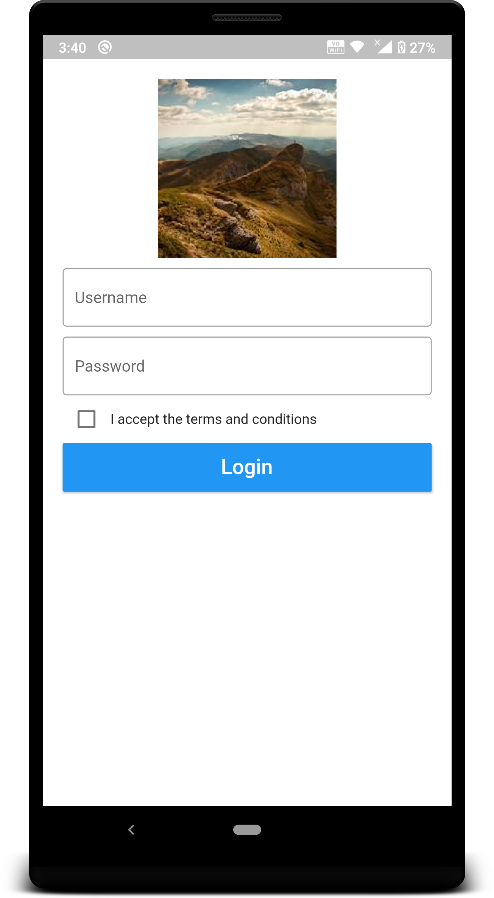
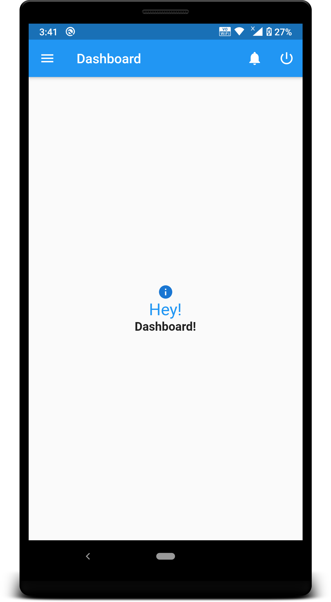
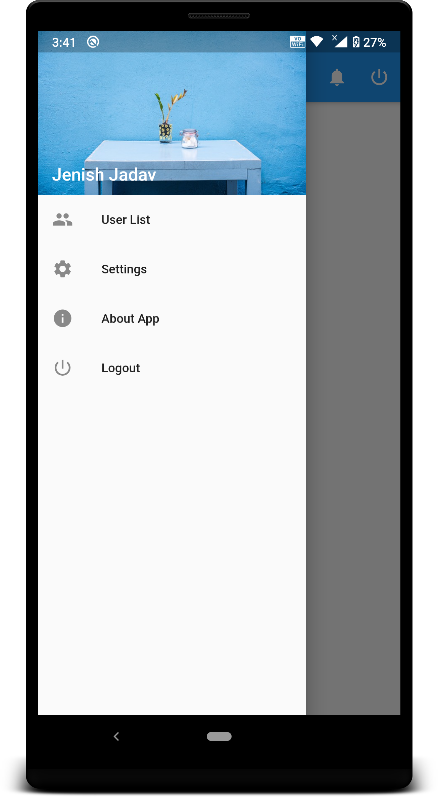
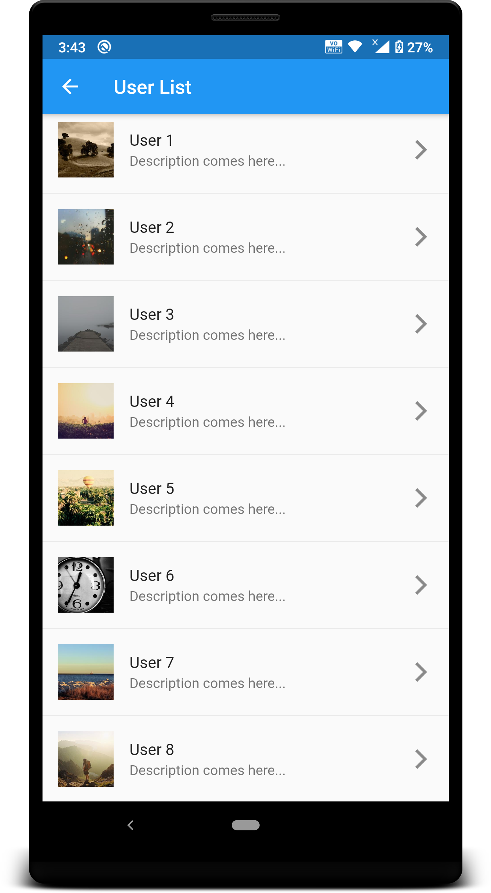

# Flutter Demo
A collection of basic app requirement like Splash, Login, Drawer Navigation, List, and API integration.

## Getting Started
To build and run this project:

1. Get Flutter [here](https://flutter.dev) if you don't already have it
2. Clone this repository.
3. `cd` into the repo folder.
4. run `flutter run-android` or `flutter run-ios` to build the app.

### Features

- [Splash Screen ](/lib/splash_screen.dart) with 5 seconds delay
- [Login Screen ](/lib/login_screen.dart) using REST API
- [Dashboard Screen](/lib/home_screen.dart) with Drawer Navigation
- [User List](/lib/user_list.dart) with REST API and ListView Widget
 

### Screenshots

    
